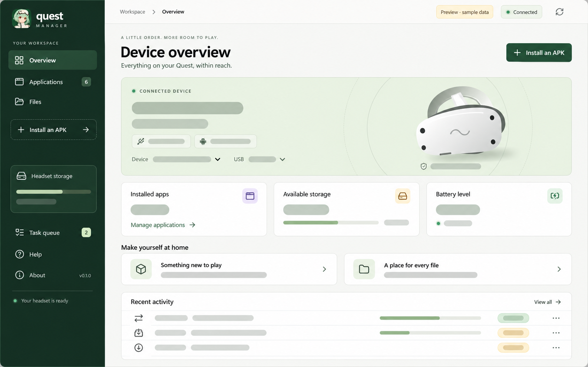

<p align="center">
  
</p>

<h1 align="center">Quest Manager</h1>

<p align="center">
  Manage apps and files on your Meta Quest through a local ADB connection.
</p>

<p align="center">
  <strong>English</strong> · <a href="README.zh-CN.md">简体中文</a>
</p>

<p align="center">
  <a href="docs/README.md">Documentation</a> ·
  <a href="docs/getting-started.md">Getting Started</a> ·
  <a href="AGENTS.md">Agent Guide</a> ·
  <a href="CONTRIBUTING.md">Contributing</a> ·
  <a href="SECURITY.md">Security</a> ·
  <a href="PRIVACY.md">Privacy</a>
</p>

Quest Manager is a Windows desktop companion for Meta Quest, with development
and usability focused on Quest 3. There is no headset model restriction; other
models can use the operations supported by their ADB and Android permissions.
It combines an English interface with native file
pickers, background tasks, and the official Android Platform-Tools ADB client.
The stack is **Tauri 2 + React + TypeScript + Rust**.

<p align="center">
  
  <br>
  <sub>Illustrative rendering based on fictional preview data. Device details and activity content are shown as placeholders.</sub>
</p>

## Key Features

- **Device management.** Use the Devices page to add USB or Wi-Fi connections,
  see both transports, and manage headset settings. USB is preferred when both
  transports are ready, with Wi-Fi as fallback. The page also controls stay
  awake while charging and opens Lightning Launcher setup.
- **Wireless connection.** Devices opens USB setup, QR pairing, and six-digit
  code pairing when supported by headset settings.
- **Device overview.** Inspect the model, Android version, battery, and shared
  storage. Quest 3, Quest 3S, and Quest 2 have model-specific headset
  illustrations, with generic artwork for unknown models.
- **Install from your computer.** Select or drop ordinary APK files, review the
  expected name/icon, target headset and installed-version comparison, and queue
  installations or compatible updates. Optionally customize the display name/icon
  or try compatibility signing.
- **Application management.** Search app names or package IDs, view icons,
  versions, APK sizes and enabled state; filter inferred Meta Store/sideload
  sources. Session caching preserves names/icons across filters and app removal.
  Inspect install times, SDK/ABI,
  permissions, splits, signing certificates and VR declarations; export APKs
  or uninstall third-party apps.
- **Shared file management.** Browse, upload, and download files or folders;
  create directories, rename items, and delete selected content.
- **Visible background work.** Follow a serial task queue with ADB progress and
  errors and captured target connections. Cancel queued work or supported running
  transfers while browsing, and clear completed records. Closing with active
  tasks prompts to keep waiting before an explicit exit.
- **Reproducible setup.** Use pinned tools and locked dependencies, with Rust,
  ADB, npm packages, and build caches kept inside the project environment.

## Quick Start

### 1. Prepare the computer

Use Windows x64 and 64-bit PowerShell. The bootstrap installs pinned
**Node.js 24.19.0 / npm 11.17.0** under `env/node`; no system Node installation
is needed. It checks these system prerequisites:

- Visual Studio 2022 / Build Tools (17.x) with x64 MSVC >= 14.30.
- Windows SDK >= 10.0.19041.0, including x64 libraries, headers and `rc.exe`.
- Microsoft Edge WebView2 Runtime >= 110.0.1531.0.

Missing, incomplete or older components are reported with the required versions.
Setup asks before installing/updating system components with Microsoft's signed
installers; compatible installations are reused. See [Getting Started](docs/getting-started.md)
for the repair scope and manual installation links.

Allow at least 8 GB for tools and build caches. The first setup downloads the
pinned toolchain and dependencies; the first Rust build takes longer than
subsequent builds. See [Getting Started](docs/getting-started.md) for details.

### 2. Install dependencies and start the app

Open PowerShell in the repository root:

```powershell
.\run-install.ps1
.\run-dev.ps1
```

Project-local setup does not require administrator privileges or change the
permanent PATH. Optional C++/SDK installation requests administrator approval;
the script never automatically reboots. If PowerShell blocks local scripts,
use a process-scoped invocation:

```powershell
powershell.exe -NoProfile -ExecutionPolicy Bypass -File .\run-install.ps1
powershell.exe -NoProfile -ExecutionPolicy Bypass -File .\run-dev.ps1
```

Use `.\run-install.ps1 -CheckOnly` to check system prerequisites without downloads
or changes. Use `-NonInteractive` to install project tools without prompts; it
fails if system prerequisites need attention and never installs them silently.

### 3. Connect the headset

Enable developer mode on the Quest, connect a USB data cable, and allow USB
debugging inside the headset. Choose the headset in **Devices**.

Use **Applications** to install or inspect APKs and **Files** to browse shared
storage. Follow operations in **Task queue** and wait for active work to finish
before closing the app. Open **Devices** and choose **Add connection** for
wireless setup. Its three tabs are **USB setup**, **QR code**, and
**Pairing code**. USB setup checks existing authorization first, then pairs only
if needed and connects automatically. Code and QR pairing also connect after
verification. Keep both devices on the same local network; deep sleep disconnects
Wi-Fi, and ADB can reconnect on wake while wireless debugging remains enabled.
QR setup has a two-minute deadline and cancellation. In Lightning Launcher,
open **Android Settings → System → Developer options → Debugging → Wireless
debugging → Pair device with QR code**. Use **Lightning Launcher setup** in
Quest Manager to obtain the launcher. Availability varies by headset OS; the
Meta mobile app's QR pairing does not establish debugging scanner support.
Use USB setup if that entry is absent.
Wait for active tasks to finish before setup. Existing ADB connections also
appear automatically. See [wireless setup](docs/product/workflows.md#wireless-setup).

See [Troubleshooting](docs/operations/troubleshooting.md) if setup or connection
fails.

## Applications and Files

| Action | Result | Scope |
| --- | --- | --- |
| Install APK | Install an ordinary APK or apply a compatible update, with optional OBB files | Each APK and its selected OBB files form one task |
| Export application | Save all installed APK files into a new local folder | Includes splits; excludes private app data and saved games |
| Uninstall application | Remove an app and its app data after confirmation | Third-party apps only |
| Upload or download | Copy files or folders through a temporary destination | Existing final items are refused |
| Rename or delete | Organize shared files; confirm permanent deletion | Android permissions and protected containers still apply |

File management is limited to `/sdcard`, with `/storage/emulated/0` accepted as
an alias. Access to `Android/data` and `Android/obb` depends on the headset OS.
General private-app storage access and complete saved-game backups are outside
the current scope.

Installation does not support XAPK/APKS/APKM archives or split-set installation.
In the review, **Add OBB files** selects multiple local `.obb` files; dropping
OBB files into an open review attaches them to its selected APK. A readable APK
package name is required. Files keep their names under
`/sdcard/Android/obb/<package>/`. The task checks existing files before installing,
then installs the APK and transfers/verifies its OBB files. Identical existing
files are reused; different content is refused. A later OBB failure reports that
the APK is installed and data is incomplete, preserving completed files for a
manual retry. Running installation tasks cannot be cancelled.
APK previews work without a headset. **Modify and re-sign APK** creates a private
copy; appearance changes rebuild resources, while **Compatibility install** can
re-sign without appearance changes. Prepared copies disable verity signatures to
address some large-APK verification overflows. Re-signing changes the signing
identity and may affect updates or game features. Back up local signing keys;
see [Privacy](PRIVACY.md). Originals are preserved and conflicting installations
are never automatically uninstalled.
Compatible APK updates use Android's replace-install behavior; signature,
downgrade, ABI, or storage failures are reported rather than worked around by
automatically uninstalling an existing app.

Transfers reject Windows-incompatible download names, case-only collisions,
and descendant symbolic links. Interrupted transfers can leave a reported
`.quest-manager-*.partial` item when cleanup cannot complete. Task history lasts
for the current session, with no automatic retry, restart resume, or recycle bin.
See [Product Workflows](docs/product/workflows.md) for the complete behavior.

App names and raster icons load progressively from bounded reads of the base
APK. English labels are preferred when available. Adaptive/vector icons and
resources stored only in splits can use a generic fallback. APK size excludes
data, cache and OBB files. Certificate fingerprints do not verify publisher
identity or APK integrity; VR declarations do not guarantee compatibility.
Artwork metadata is cached locally; **Clear cached artwork** removes the disk
cache and pauses background reads until **Load app details** or refresh.
See [Privacy](PRIVACY.md) for cache locations and retention.

## Optional Lightning Launcher Setup

The **Devices** page offers **Lightning Launcher** setup for the selected
headset. It remains available regardless of the Applications inventory.

Setup fetches stable APK releases from the author's public GitHub repository on
demand. Select a Launcher version and optionally the Navigator Button Redirection
Service. The service defaults to the release explicitly referenced by the chosen
Launcher version; other versions are labeled unverified. Installation retains
original signatures and uses the existing task queue. The service must then be
enabled in the headset's Accessibility settings. No permissions are enabled
automatically. See [Product workflows](docs/product/workflows.md#lightning-launcher)
and [Privacy](PRIVACY.md#optional-app-downloads).

## Local Files

| Project path | Purpose |
| --- | --- |
| `env/` | Node/npm, Rust, ADB, AAPT2 and APK preparation tools, npm packages, private local data, caches, build output, and installation records |
| `node_modules/` | Windows junction pointing to `env/node_modules` |
| `dist/` | Built frontend assets |
| `release/` | Portable executable, Platform-Tools, AAPT2, APK preparation tools, and local build environment record |
| `src-tauri/gen/` | Generated Tauri schemas |

These generated locations are ignored by Git. Source code, version manifests,
and both dependency lockfiles are the inputs needed to recreate the project
environment. See [Dependencies](docs/development/dependencies.md) for the full
layout and [Privacy](PRIVACY.md) before sharing local records.

## Reproducible Setup

| Component | Pinned version or source |
| --- | --- |
| Node.js / npm | 24.19.0 / 11.17.0; official Windows ZIP and SHA-256 in `toolchain.versions.json`, versions also in `.node-version` and `package.json` |
| Rust / target | 1.95.0 / `x86_64-pc-windows-msvc`; `rust-toolchain.toml` |
| rustup | 1.29.0; fixed archive URL and SHA-256 |
| Android Platform-Tools | 37.0.1; fixed archive URL and SHA-256 |
| Android AAPT2 | 9.4.0-15978811 (2.20-15978811); fixed Maven archive URL and SHA-256 |
| APK preparation | Apktool 3.0.3, Android Build Tools 37.0.0 (apksigner/zipalign), Temurin JRE 21.0.12.1+1; fixed URLs and SHA-256 |
| APK editing crates | quick-xml 0.42.0, png 0.18.1, getrandom 0.3.4; exact versions in `Cargo.toml` |
| Local debugging QR encoding | qrcode 0.14.1; default features disabled |
| APK metadata crates | zip 4.6.1, sha2 0.10.9, base64 0.22.1; exact versions in `Cargo.toml` |
| Tauri Rust / CLI / JS API | 2.11.5 / 2.11.4 / 2.11.1 |
| HTTPS / reqwest | 0.13.5; rustls |
| React / TypeScript / Vite | 19.3.0 / 7.0.2 / 8.2.2 |
| JavaScript dependency tree | Exact direct versions and `package-lock.json` |
| Rust dependency tree | Exact direct versions and `src-tauri/Cargo.lock` |
| Optional installer tools | Downloaded and verified by the pinned Tauri CLI; cached under `env/target/.tauri` |

Normal installation uses `npm ci` and `cargo fetch --locked`. Lockfiles are
regenerated only during an intentional dependency update with `-RefreshLocks`.
Tauri components are released independently and do not need matching patch
versions.

Visual Studio, Windows SDK, and WebView2 remain system prerequisites. Local
installation and build records capture their actual environment details, but
are not committed. Reproducibility here means toolchain and dependency selection,
not byte-identical output across different system or signing environments.
Read [Dependencies and Reproducibility](docs/development/dependencies.md) before
changing versions.

## Build

```powershell
.\run-build.ps1
.\run-build.ps1 -Installer
```

The portable executable is `release/quest-manager.exe`. Keep its
`platform-tools`, `aapt2` and `apk-tools` directories, DLLs, and license files with
it. The optional NSIS installer is written under `env/target/release/bundle/nsis`.

Review local environment records before distributing build output. See
[Commit and Release](docs/development/commit-and-release.md) for version
locations, packaging details, and artifact handling.

## Browser Preview

After installing dependencies, load `. .\scripts\Environment.ps1`, run
`npm.cmd run dev` and open
[the preview](http://127.0.0.1:1420/?preview=1). It shows **Preview · sample data**
with fictional device and file entries; device writes are disabled. Real
operations require the desktop app.

The preview and Tauri development use the same strict port. Stop a standalone
Vite instance before starting `run-dev.ps1`.

## Documentation

| Goal | Start here |
| --- | --- |
| Install and connect a headset | [Getting Started](docs/getting-started.md) |
| Understand user-visible behavior | [Product Specs](docs/product/index.md) |
| Configure and diagnose the runtime | [Configuration](docs/operations/configuration.md) · [Troubleshooting](docs/operations/troubleshooting.md) |
| Understand data and system boundaries | [Architecture](docs/architecture/index.md) |
| Review design and security contracts | [Design](DESIGN.md) · [Security](SECURITY.md) · [Privacy](PRIVACY.md) |
| Find every public document | [Documentation Index](docs/README.md) |

## Development and Contributing

Development setup, validation, and maintenance procedures live under
`docs/development/`. Start with the relevant guide:

- [Local Development](docs/development/local-dev.md)
- [Testing](docs/development/testing.md)
- [Dependencies](docs/development/dependencies.md)
- [Contributing](CONTRIBUTING.md)
- [Code of Conduct](CODE_OF_CONDUCT.md)
- [Agent Guide](AGENTS.md)

Use `run-test.ps1` for the routine frontend and Rust checks. Device integration
tests are opt-in; read the testing guide before using a connected headset.
The product UI remains English; the linked Chinese README is documentation.

Bug and feature templates and a pull request checklist are included in `.github`.
Security reports follow the private reporting procedure in [Security](SECURITY.md).
Before publishing, use the [release checklist](docs/development/commit-and-release.md)
and [third-party component index](THIRD_PARTY.md).

## Security and Privacy

Quest Manager runs with the local user's privileges and delegates device access
to ADB and Android's debugging permissions. It uses explicit application
commands for supported operations and has no cloud sync or analytics integration.

Device identifiers, application inventories, paths, and ADB output can appear
in the interface and diagnostics. Review [Privacy](PRIVACY.md) before sharing
screenshots or logs, and follow [Security](SECURITY.md) for sensitive reports.

## About and License

Quest Manager was developed by **yexca** using **Codex**, with **GPT-6-Astra** as
the development model. The **About** page includes the project introduction,
core tools/frameworks and their pinned versions, source repository and the full
license. It is available without a headset. Connection guidance remains in **Help**.

Source code: [github.com/yexca/quest-manager](https://github.com/yexca/quest-manager).

Copyright © 2026 yexca. Quest Manager is licensed under the
[GNU Affero General Public License, version 3 only](LICENSE)
(`AGPL-3.0-only`), without any warranty. Third-party components retain their own
licenses; the project license does not replace bundled dependency notices.
