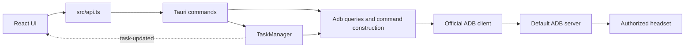

# Architecture

Quest Manager has one Tauri process, a React webview, and child ADB clients.
There is no HTTP application backend or database. The Vite server exists only
for development and browser preview.

## Source Map

| Owner | Responsibility |
| --- | --- |
| [src/main.tsx](../../src/main.tsx) | React root and stylesheet loading |
| [src/App.tsx](../../src/App.tsx) | Pages, selection, dialogs, data reads, native file pickers and drag/drop |
| [src/Headset.tsx](../../src/Headset.tsx) | Model matching and Overview headset SVG illustrations |
| [src/useDeviceDiscovery.ts](../../src/useDeviceDiscovery.ts) | Device polling and its lifetime guard |
| [src/deviceState.ts](../../src/deviceState.ts) | Profile merging, known-device selection, preferred transport selection, and serialized discovery |
| [src/DeviceAddWizard.tsx](../../src/DeviceAddWizard.tsx) | USB, QR, and pairing-code device registration with profile naming and wireless offer |
| [src/QrPairing.tsx](../../src/QrPairing.tsx) | QR session display, status polling and cancellation |
| [src/useTaskQueue.ts](../../src/useTaskQueue.ts) | Task subscription, clearing and batched refresh signals |
| [src/useApplications.ts](../../src/useApplications.ts) | Complete package inventory, session cache lifecycle and incremental enrichment |
| [src/Devices.tsx](../../src/Devices.tsx) | Device profile list, connection status, preferred transport, auto-switch, stay-awake and Launcher settings |
| [src-tauri/src/device_profiles.rs](../../src-tauri/src/device_profiles.rs) | Validated private device profiles and auto-switch persistence |
| [src/applicationState.ts](../../src/applicationState.ts) | Installer classification, package invalidation and cache reconciliation |
| [src/taskState.ts](../../src/taskState.ts) | Revision merging, stream initialization and refresh policy |
| [src/InstallReview.tsx](../../src/InstallReview.tsx) | Per-file APK preview, appearance/crop controls and compatibility options |
| [src/installState.ts](../../src/installState.ts) | Review package checks, stale-response disposal, numeric version comparison and duplicate detection |
| [src/obbState.ts](../../src/obbState.ts) | OBB attachment eligibility, collision handling and request construction |
| [src/About.tsx](../../src/About.tsx) | Offline project credits/license, manifest-derived dependencies and repository link |
| [src/AppMetadata.tsx](../../src/AppMetadata.tsx) | Application artwork and details tabs |
| [src/LightningSetup.tsx](../../src/LightningSetup.tsx) | Optional Launcher setup, release selection and activation guidance |
| [src/lightningState.ts](../../src/lightningState.ts) | Release matching and fictional preview catalog |
| [src-tauri/src/lightning.rs](../../src-tauri/src/lightning.rs) | Fixed GitHub catalog, addon recommendations and HTTPS downloads |
| [src/api.ts](../../src/api.ts) | Typed IPC calls and explicit fictional browser preview |
| [src/types.ts](../../src/types.ts) | Frontend data and task contracts |
| [src/styles.css](../../src/styles.css) | Shared layout and interface styling |
| [src-tauri/src/main.rs](../../src-tauri/src/main.rs) | Windows application entry |
| [src-tauri/src/lib.rs](../../src-tauri/src/lib.rs) | Tauri setup, ADB location, managed state, and command registration |
| [src-tauri/src/adb.rs](../../src-tauri/src/adb.rs) | Read queries, parsing, path checks, quoting, ADB process construction |
| [src-tauri/src/wireless_tests.rs](../../src-tauri/src/wireless_tests.rs) | Host-only wireless protocol and failure tests |
| [src-tauri/src/qr_pairing.rs](../../src-tauri/src/qr_pairing.rs) | Local QR credentials, encoding and session snapshots |
| [src-tauri/src/qr_tests.rs](../../src-tauri/src/qr_tests.rs) | Host-only QR lifecycle and device matching tests |
| [src-tauri/src/metadata.rs](../../src-tauri/src/metadata.rs) | Package dump parsing, metadata IPC models, extraction gate and bounded cache |
| [src-tauri/src/apk.rs](../../src-tauri/src/apk.rs) | APK byte-range reader, ZIP limits, AAPT2 resource decoding, raster icons and signing-block fingerprints |
| [src-tauri/src/apk_edit.rs](../../src-tauri/src/apk_edit.rs) | Resource staging, manifest editing and compressed game-payload preservation |
| [src-tauri/src/apk_install.rs](../../src-tauri/src/apk_install.rs) | Local preview/preparation, private signing keys and output verification |
| [src-tauri/src/obb.rs](../../src-tauri/src/obb.rs) | Local OBB inspection, filename validation and streaming hashes |
| [src-tauri/src/tasks.rs](../../src-tauri/src/tasks.rs) | Task validation, global queue, mutations, transfers, cancellation, cleanup |
| [src-tauri/src/device_tests.rs](../../src-tauri/src/device_tests.rs) | Opt-in fixture-based device integration test |
| [src-tauri/src/obb_tests.rs](../../src-tauri/src/obb_tests.rs) | Host-only composite install tests using a synthetic ADB executable |
| [scripts/Environment.ps1](../../scripts/Environment.ps1) | Process-local tool paths and installed-environment checks |
| [src-tauri/tauri.conf.json](../../src-tauri/tauri.conf.json) | Window, CSP, build hooks, bundled resources, installer target |
| [src-tauri/capabilities/default.json](../../src-tauri/capabilities/default.json) | Main-window core and dialog permissions |

## Frontend

`App.tsx` currently owns the page state and small UI components. React hooks
manage device/transport selection, apps, files, task snapshots, and modal state;
there is no router or external state store. Add feature boundaries when they
improve a real workflow, rather than creating parallel abstractions prematurely.

`api.ts` is the application IPC boundary. Task events live in `useTaskQueue.ts`;
native file/drag-drop and blocked-close events remain in `App.tsx`. Preserve
listener disposal, effect lifetime guards, and revision-aware task merging.
Do not put ADB command text or validation policy in the UI.

Device discovery shares periodic reads. An explicit refresh supersedes any older
pending snapshot and starts a fresh read after that request settles; repeated
refreshes share that fresh read. Disposal prevents late publication. Saved
profiles are merged with discovery so known offline devices remain visible, but
no transport is invented for them. Automatic selection considers saved devices
only; an explicitly selected device remains selected. A newly ready unknown
device is shown as a candidate for adding rather than silently selected.
Per-device `auto` preference chooses USB before Wi-Fi; `usb` and `wifi` restrict
selection to that transport. The global auto-switch setting may select a newly
ready known device when no task is active; otherwise the UI asks before a
switch. These rules do not change an existing task's captured transport or
reconnect a device.

In a normal browser, calls fail with a desktop-app instruction. Only the explicit
`?preview=1` mode returns sample read data. `canWrite` requires both a ready
transport and the desktop runtime.

## Backend

`lib.rs` exposes business commands and delegates to `Adb` or `TaskManager`.
Read queries do not acquire the mutation semaphore. The task manager owns one
semaphore permit for the entire app, shared across devices, and keeps snapshots
in a mutex-protected map.

ADB is located from `env/platform-tools` in debug builds and Tauri's resource
directory in release builds. Child processes receive separate argument values,
normally have no interactive stdin, and use hidden process creation on Windows.
Explicit wireless pairing supplies only the validated code through piped stdin
so it does not enter process arguments. Shell
fragments run on Android and require separate quoting and path validation.

Application enrichment uses a separate backend single-permit gate, shared with cache
clearing. The UI schedules one list enrichment request at a time and shares an
in-flight request with an open details dialog. Leaving the page or changing
transport stops scheduling and discards stale responses; one bounded active
read can finish. This does not acquire or change the mutation queue.

APK extraction uses a blocking worker with bounded ADB reads and a bundled
AAPT2 subprocess. Only a temporary manifest/resource-table ZIP is staged;
immutable presentation metadata is cached. Live state/grants are read afresh.
See [ADR-0004](../decisions/ADR-0004-application-metadata.md).

## Contracts to Read Next

- [Core boundaries](core-boundaries.md)
- [Data model and IPC](data-model.md)
- [Runtime workflows](workflows.md)
- [Durable decisions](../decisions/index.md)

Keep this map aligned with actual source files when modules are extracted.
