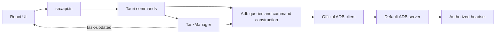

# Architecture

Quest Manager has one Tauri process, a React webview, and child ADB clients.
There is no HTTP application backend or database. The Vite server exists only
for development and browser preview.

## Source Map

| Owner | Responsibility |
| --- | --- |
| [src/main.tsx](../../src/main.tsx) | React root and stylesheet loading |
| [src/App.tsx](../../src/App.tsx) | Pages, selection, dialogs, polling, native file pickers, drag/drop, task subscription |
| [src/api.ts](../../src/api.ts) | Typed IPC calls and explicit fictional browser preview |
| [src/types.ts](../../src/types.ts) | Frontend data and task contracts |
| [src/styles.css](../../src/styles.css) | Shared layout and interface styling |
| [src-tauri/src/main.rs](../../src-tauri/src/main.rs) | Windows application entry |
| [src-tauri/src/lib.rs](../../src-tauri/src/lib.rs) | Tauri setup, ADB location, managed state, and command registration |
| [src-tauri/src/adb.rs](../../src-tauri/src/adb.rs) | Read queries, parsing, path checks, quoting, ADB process construction |
| [src-tauri/src/tasks.rs](../../src-tauri/src/tasks.rs) | Task validation, global queue, mutations, transfers, cancellation, cleanup |
| [src-tauri/src/device_tests.rs](../../src-tauri/src/device_tests.rs) | Opt-in fixture-based device integration test |
| [scripts/Environment.ps1](../../scripts/Environment.ps1) | Process-local tool paths and installed-environment checks |
| [src-tauri/tauri.conf.json](../../src-tauri/tauri.conf.json) | Window, CSP, build hooks, bundled resources, installer target |
| [src-tauri/capabilities/default.json](../../src-tauri/capabilities/default.json) | Main-window core and dialog permissions |

## Frontend

`App.tsx` currently owns the page state and small UI components. React hooks
manage device/transport selection, apps, files, task snapshots, and modal state;
there is no router or external state store. Add feature boundaries when they
improve a real workflow, rather than creating parallel abstractions prematurely.

`api.ts` is the application IPC boundary. Tauri event subscription and native
file/drag-drop integration remain in `App.tsx`. Preserve listener disposal,
effect lifetime guards, and task merging when extracting these responsibilities.
Do not put ADB command text or validation policy in the UI.

In a normal browser, calls fail with a desktop-app instruction. Only the explicit
`?preview=1` mode returns sample read data. `canWrite` requires both a ready
transport and the desktop runtime.

## Backend

`lib.rs` exposes business commands and delegates to `Adb` or `TaskManager`.
Read queries do not acquire the mutation semaphore. The task manager owns one
semaphore permit for the entire app, shared across devices, and keeps snapshots
in a mutex-protected map.

ADB is located from `env/platform-tools` in debug builds and Tauri's resource
directory in release builds. Child processes receive separate argument values,
have no interactive stdin, and use hidden process creation on Windows. Shell
fragments run on Android and require separate quoting and path validation.

## Contracts to Read Next

- [Core boundaries](core-boundaries.md)
- [Data model and IPC](data-model.md)
- [Runtime workflows](workflows.md)
- [Durable decisions](../decisions/index.md)

Keep this map aligned with actual source files when modules are extracted.
