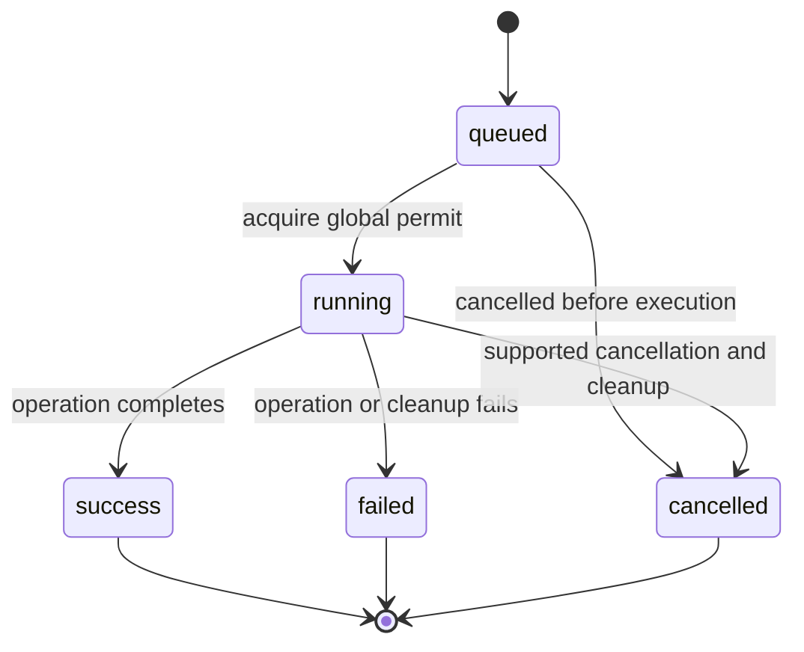

# Runtime Workflows

## Discovery and Read Queries

The UI requests devices initially, on refresh, and every 15 seconds. A frontend
guard prevents overlapping discovery polls. The backend parses `adb devices -l`,
queries `ro.serialno` for ready transports, and groups by the resulting identity.
Ready connections sort ahead of unavailable ones, with USB preferred.

The UI keeps a physical selection and optional preferred transport. It uses a
ready preferred transport when present, then another ready transport for future
queries. Device information is queried on selection/refresh and every 30
seconds. Apps reload on selection, system-filter change, or refresh; files load
when the Files page is active and its path/selection/refresh changes.

Queries use the 30-second timeout in `Adb::run`. Metadata and directory output
are buffered. Listings use NUL-separated fields so spaces, quotes, tabs, and
newlines in supported UTF-8 names do not become record boundaries.

## Queuing and Execution

1. The UI gathers the selected path/package and transport. Destructive actions
   pass through their confirmation dialog.
2. `start_task` validates the request, inserts a queued snapshot, emits it, and
   spawns asynchronous work.
3. The task waits for the single global semaphore or a cancellation request.
   It performs device checks when it starts, since state can change while queued.
4. Execution reports running state and ADB output. Transfer subprocesses support
   cancellation; each long-running task subprocess has a one-hour timeout.
   Short helper queries still use the 30-second query timeout.
5. Completion publishes a terminal snapshot. A success event causes the UI to
   refresh device, app, and active directory data.

The one-hour limit applies per subprocess, not to the whole queue or necessarily
to a multi-file export. Output readers retain a bounded tail, while snapshot
details are truncated. These bounds are not redaction rules.

## APK Preparation

`inspect_apk` serializes local previews separately from the mutation queue.
Read-only previews do not create signing keys. An install with options checks the
preview stamp, stages a private copy and optionally rebuilds its resources with
Apktool/AAPT2. It aligns, signs with a per-package key and verity disabled, verifies
with apksigner, and rereads the output before `adb install -r`. Java temporary
files stay in that task directory. Normal success/failure removes staging; a
cleanup error reports the exact path. No existing app is uninstalled to resolve
a signature conflict. See [ADR-0005](../decisions/ADR-0005-local-apk-preparation.md).

## Staged Transfers

Upload validates the local source and remote parent, checks that final and
temporary paths are absent, pushes to a `.partial` sibling, then publishes with
a no-clobber remote move. The move also checks that the source disappeared so
ADB cannot silently report a skipped overwrite as success.

Download checks the remote path and tree for Windows compatibility, pulls to a
temporary sibling in the chosen local parent, rechecks the final destination,
and renames the temporary item. Descendant symbolic links and conflicting
case-only names are rejected before transfer.

Export retrieves all package-manager APK paths, pulls them into a temporary
local directory, then publishes a package/task-named folder. This does not copy
private app data or install an exported split set.

Ordinary transfer failures attempt cleanup only for the task's temporary path.
A lost connection can prevent remote cleanup. Such an error includes the
potential residual path and can make a cancellation finish as `failed`.
Do not delete unrelated `.partial` paths or retry the task automatically.

## Session Lifetime

The queue and snapshots exist for the life of the Tauri process. Closing a page
or queue dialog does not stop work, but closing the application provides no
durable resume or cleanup guarantee. ADB/Android may already have applied an
operation when its client disappears. Task completion is not proof that another
process has not subsequently changed the same file.

See [Product workflows](../product/workflows.md) for user-facing behavior,
[Core boundaries](core-boundaries.md) for guarantees, and
[Troubleshooting](../operations/troubleshooting.md) for recovery.
