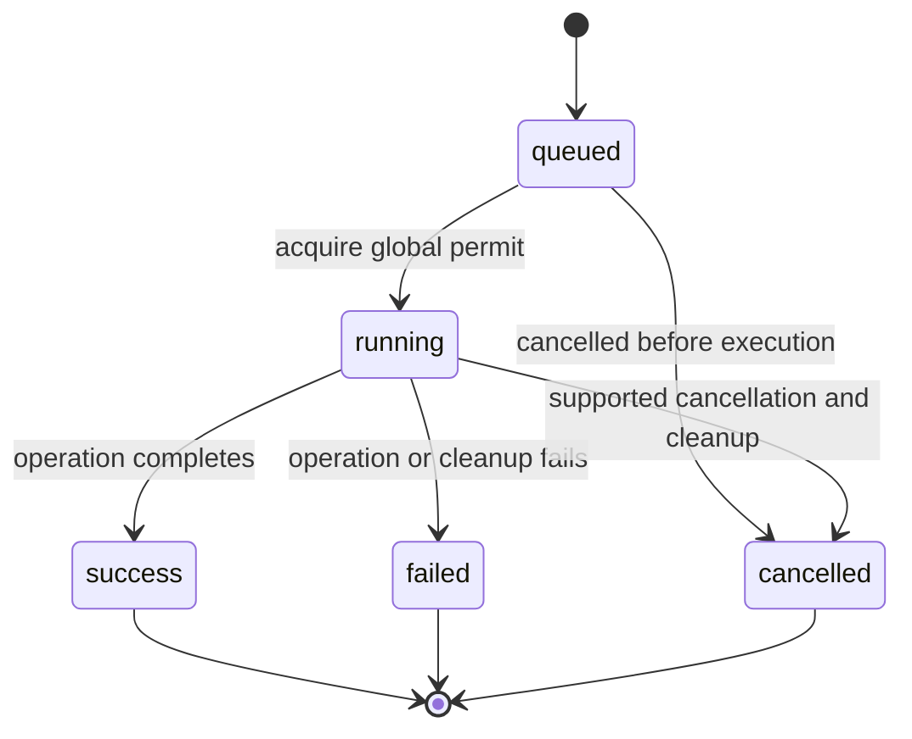

# Runtime Workflows

## Discovery and Read Queries

The UI requests devices initially, on refresh, and every 15 seconds. A frontend
guard prevents overlapping discovery polls. The backend parses `adb devices -l`,
queries `ro.serialno` for ready transports, and groups by the resulting identity.
Ready connections sort ahead of unavailable ones, with USB preferred.

After explicit wireless connection succeeds, the UI waits for any older
discovery request, then requests a fresh snapshot and selects the matching
ready serial. This prevents an in-flight pre-connection poll from swallowing
the connection refresh. Wireless setup uses a strict pair/USB request union in
`adb.rs` under the global queue permit. Code pairing has a 90-second deadline,
including up to 30 seconds discovering the paired GUID's connection. Explicit
connect checks ADB's text result (exit zero alone is insufficient) and readiness
in `devices -l`. Existing tasks never change their target.

USB setup checks the captured USB serial and physical identity, then reuses any
ready Wi-Fi transport with that same identity. Otherwise it reads one `wlan0`
IPv4 route and current BSSID, stages the embedded first-party DEX in a random
owned `/data/local/tmp/quest-manager-wireless-*` directory using binary-preserving
`exec-in`, verifies SHA-256, marks it read-only, and runs it as the
authorized shell user. The helper calls named system ADB methods to enable TLS
debugging for that network and obtain its dynamic port. The parent attempts
connection with existing trust first. Only an authentication failure requests a
fresh pairing service; unrelated connection failures do not trigger pairing.
The resulting Wi-Fi transport must return the captured USB `ro.serialno`.

USB identity preflight has 20 seconds, network checks 15 seconds, setup 60 seconds,
child shutdown 5 seconds, and final cleanup 10 seconds. Cleanup is awaited under
the permit, not dropped by an outer request timeout. The shell wrapper also
limits a started helper to 75 seconds and attempts cleanup on exit/disconnection.
Staging collisions are refused; only an owned directory is cleaned. Completed
pairing/debugging stays enabled; cleanup removes the helper and stops a pairing
listener requested by this operation. Abrupt exits can leave staging files.

QR setup is a separate in-memory start/status/cancel session under that same
permit, with a two-minute deadline. The frontend polls its stored status every
500 ms. The worker polls ADB mDNS at one-second intervals until the exact random
pairing service appears, submits one pairing request, and discovers only the
returned GUID's connection. A ready auto-connected TLS transport can be reused;
otherwise one connection attempt follows. Verify a readable device GUID, or when
hidden, the exact authenticated TLS service transport for the paired GUID.
A numeric address alone is insufficient in this case. Cancel or expiry drops the worker/client;
already submitted pairing can still finish in the shared server. See
[ADR-0008](../decisions/ADR-0008-explicit-wireless-setup.md).

The UI keeps a physical selection and merges the discovery snapshot with saved
device profiles. Known profiles without a current transport remain visible as
offline devices. An explicit selection is preserved; with no selection, the UI
chooses a ready known profile and otherwise an offline known profile. A ready
device without a profile stays unselected and produces an add-device notice.
Each profile's `connectionPreference` controls transport choice: `auto` uses
USB before Wi-Fi, while `usb` and `wifi` require that transport and report the
device as disconnected if it is unavailable. The selected transport serial is
the only value passed to device commands.

When a newly ready known device appears, `autoSwitch` selects it immediately if
no task is active. Active tasks defer the switch until they finish. With
auto-switch disabled, or for an unknown device, the UI keeps the current
selection and offers an explicit switch or profile creation. This notification
does not retarget existing tasks.

Device information and power settings are queried on selection/refresh and
device information every 30 seconds. The complete app list reloads on
connection selection or refresh; system/source filters operate on the in-memory
list. Files load when the Files page is active and its path/selection/refresh
changes.

Queries use the 30-second timeout in `Adb::run`. Metadata and directory output
are buffered. Listings use NUL-separated fields so spaces, quotes, tabs, and
newlines in supported UTF-8 names do not become record boundaries.

## Queuing and Execution

1. The UI gathers the selected path/package and transport. Destructive actions
   pass through their confirmation dialog.
2. `start_task` validates the request, inserts a queued snapshot, emits it, and
   spawns asynchronous work.
3. The task waits for the single global semaphore or a cancellation request.
   It performs device checks when it starts, since state can change while queued.
4. Execution reports running state and ADB output. Transfer subprocesses support
   cancellation; each long-running task subprocess has a one-hour timeout.
   Short helper queries still use the 30-second query timeout.
5. Completion publishes a terminal snapshot with an incremented revision.
   Successes and failed installs with `apkInstalled` are grouped into 350 ms batches per captured transport. Only the
   currently selected physical device's transports affect displayed data:
   install/uninstall refresh app and device information; upload/mkdir/rename/delete
   refresh files and device information. Download/export do not refresh device
   data. These automatic reads preserve displayed lists and open app details;
   device discovery is unaffected. Explicit refresh still reloads all areas.

   Composite OBB installs additionally refresh files, including after partial
   completion. No refresh is triggered for a preflight failure before installation.

`useApplications` owns the current transport's session cache. Lightweight package
queries include installer and base APK path (`pm list packages -f -i`) along
with version codes. Reconciliation prunes removals and retains unchanged entry
objects. Background enrichment reads missing/stale visible-type entries only;
cached system entries survive hiding/showing them. Explicit refresh invalidates
all entries; install/uninstall completions invalidate their package hints,
including same-version installs. A missing hint invalidates all details. Cached
artwork remains visible during revalidation. Replaced entries discard obsolete
in-flight results, and list/dialog reads share a pending request only within the
same current entry. Detail dialogs request fresh data on opening.

The one-hour limit applies per subprocess, not to the whole queue or necessarily
to a multi-file export. Output readers retain a bounded tail, while snapshot
details are truncated. These bounds are not redaction rules.

## APK Preparation

`inspect_apk` serializes local previews separately from the mutation queue.
Read-only previews do not create signing keys. An install with options checks the
preview stamp, stages a private copy and optionally rebuilds its resources with
Apktool/AAPT2. It aligns, signs with a per-package key and verity disabled, verifies
with apksigner, and rereads the output before `adb install -r`. Java temporary
files stay in that task directory. Normal success/failure removes staging; a
cleanup error reports the exact path. No existing app is uninstalled to resolve
a signature conflict. See [ADR-0005](../decisions/ADR-0005-local-apk-preparation.md).

## Staged Transfers

### OBB Installation

An install with `obb` stages the APK privately, retaining its signature unless
preparation was explicitly selected. The staged manifest must match the reviewed
package and the source stamp must be current. Local OBB inspection accepts only
regular `.obb` files with unique case-insensitive basenames; names are never
rewritten. Source stamps and SHA-256 checks detect changed inputs.

Preflight checks every existing target before APK installation. Directory
components beneath `/sdcard` cannot be symlinks or resolve to a different shared
path. Identical existing OBB files may be reused after checksum verification;
differing files cause refusal. After `install -r`, the task records `apkInstalled`,
verifies `pm path`, creates the package directory and processes each OBB in order.
Each upload reserves a task/index-specific `.partial` sibling, pushes, verifies
SHA-256, rechecks the directory/target and publishes with a no-clobber move.
Remote hashing has a one-hour timeout for large files.

On failure, cleanup targets only that temporary file after checking its parent
again. Uncertain reservation ownership is reported without removing the file.
Completed files and the installed APK remain; the terminal error reports partial
completion. The single global queue permit is held through all phases and local
APK cleanup. Running installation remains non-cancellable. Other queued tasks
are independent. See [ADR-0006](../decisions/ADR-0006-obb-installation.md).

### General File Transfers

Upload validates the local source and remote parent, checks that final and
temporary paths are absent, pushes to a `.partial` sibling, then publishes with
a no-clobber remote move. The move also checks that the source disappeared so
ADB cannot silently report a skipped overwrite as success.

Download checks the remote path and tree for Windows compatibility, pulls to a
temporary sibling in the chosen local parent, rechecks the final destination,
and renames the temporary item. Descendant symbolic links and conflicting
case-only names are rejected before transfer.

Export retrieves all package-manager APK paths, pulls them into a temporary
local directory, then publishes a package/task-named folder. This does not copy
private app data or install an exported split set.

Ordinary transfer failures attempt cleanup only for the task's temporary path.
A lost connection can prevent remote cleanup. Such an error includes the
potential residual path and can make a cancellation finish as `failed`.
Do not delete unrelated `.partial` paths or retry the task automatically.

## Optional Launcher Setup

`start_task` accepts an exclusive `lightning` selection for install tasks. The
backend resolves Launcher and Navigator asset IDs against its catalog before
queueing, capturing URLs, sizes and optional SHA-256 values. Downloads occur under
the single mutation permit into an exclusively created task folder. HTTPS redirects
are restricted to exact configured GitHub/CDN hosts, metadata/body sizes are
bounded, and network requests have timeouts. No device values enter URLs/headers.

All selected APKs pass size/hash, package/version and original apksigner verification
before querying installed packages and starting the first device mutation. Newer
installed version codes reject the operation, equal codes skip that component.
The Launcher is installed before its service; failure stops the sequence. Completed
components survive later failure. Download cleanup failures are visible. The
frontend shows results from normal queue snapshots, not a persistent install record.
`navigator_enabled` performs a read-only active-user Accessibility check in `adb.rs`.
No activation-setting writer is exposed.

## Session Lifetime

The queue and snapshots exist for the life of the Tauri process. Closing a page
or queue dialog does not stop work. Native window closing checks the backend
queue and prompts when work remains; Keep waiting is the default. Exit anyway
provides no durable resume or cleanup guarantee. ADB/Android may already have applied an
operation when its client disappears. Task completion is not proof that another
process has not subsequently changed the same file.

See [Product workflows](../product/workflows.md) for user-facing behavior,
[Core boundaries](core-boundaries.md) for guarantees, and
[Troubleshooting](../operations/troubleshooting.md) for recovery.
